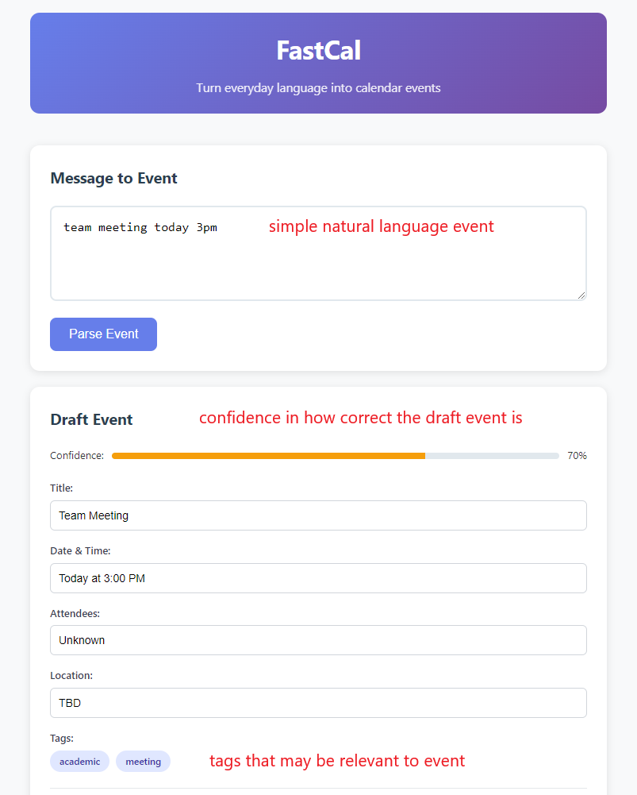

# Assignment 2

## Problem Statement

### Problem domain: Everyday Scheduling

As a student juggling classes, work, and group projects, I constantly coordinate meetings through casual messages. Phrases like "let's meet next Tuesday at 3" must be translated into structured calendar entries with titles, times, attendees, locations, and reminders. This translation takes time and mental effort, and mistakes lead to missed meetings or poor preparation.

### Problem: Natural Language to Calendar Friction

Casual scheduling messages rarely include all the details calendars need. Users must switch between messaging apps and calendar apps, manually check for conflicts, set appropriate reminders, and keep multiple calendars in sync. This process happens frequently, is prone to errors, and depends on personal habits like travel time needs and reminder preferences.

### Stakeholders

* **Primary user:** Students and professionals who want to create calendar events directly from casual messages without manual data entry.
* **Invitees:** People being invited who need clear, accurate invitations that respect their existing commitments.
* **Coordinators:** TAs, administrators, and team leads who schedule meetings across multiple people and time zones.
* **Platform providers:** Google Calendar, Outlook, Zoom, and Teams that provide integration APIs.

### Evidence and comparables

1. Calendar.help: Designing a Workflow-Based Scheduling Agent with Humans in the Loop — Hybrid agent that automates routine steps and escalates edge cases.
   [https://arxiv.org/abs/1703.08428](https://arxiv.org/abs/1703.08428)
2. Learning User Preferences and Understanding Calendar Contexts for Event Scheduling (NASA) — Deep model learns personal scheduling from historical calendars.
   [https://arxiv.org/abs/1809.01316](https://arxiv.org/abs/1809.01316)
3. How AI Calendar Assistants Are Revolutionizing Meeting Scheduling — Industry overview: timezone coordination, preference learning, conflict resolution.
   [https://superagi.com/how-ai-calendar-assistants-are-revolutionizing-meeting-scheduling-trends-and-best-practices/](https://superagi.com/how-ai-calendar-assistants-are-revolutionizing-meeting-scheduling-trends-and-best-practices/)
4. Better Appointment Scheduling With AI (OnceHub) — NL booking, automated reminders, integrations (Zoom, Salesforce).
   [https://www.oncehub.com/blog/ai-schedule-maker](https://www.oncehub.com/blog/ai-schedule-maker)
5. Lindy.ai and similar assistants — Accept NL, propose times, sync to major calendars.
   [https://lindy.ai/](https://lindy.ai/)

---

## Application Pitch

**Name:** FastCal

**Motivation:** Turn everyday language (e.g. "next Tue at 3 in 32-123") into a fully-formed, conflict-free calendar event with the right reminders, no date picker required.

**Key features:**

1. Message to Event: Paste or forward any scheduling text; parses date/time, participants, location/links, and intent (1:1, class, office hours). Shows a draft you can accept in one tap.
2. Smart Reminder Policy: Learns personal patterns (travel time, snooze behavior) and applies event-type templates (appointments, birthdays, classes) with sensible defaults.
3. Conflict-Aware Sync: Connects multiple calendars, detects conflicts and buffer violations, and proposes ranked reschedules that respect stakeholders and time zones.

## Concept Design

Below are four independent concepts. Generic types: `User`, `Account`, `Provider`, `EventId`, `Timespan`, `Uri`, `Person`, `Reminder`, `PolicyId`.

**concept IntentParser [User]**
- **purpose**: convert natural language input and context into structured draft events
- **principle**: after parsing text, provides structured event data with confidence; never writes directly to calendars
- **state**: utterances with parsed DraftEvents, alternatives, and confidence scores
- **actions**:
  - `parse (user: User, utterance: String, context: Map<String,Any>): (parsed: DraftEvent?, alts: List<DraftEvent>, confidence: Float)`
    - effect analyzes utterance and returns structured event data with alternatives
  - `accept (user: User, candidate: DraftEvent): DraftEvent`
    - effect confirms selected draft event for further processing

**concept EventDrafts [User, DraftEvent]**
- **purpose**: hold structured events before committing and track validation status
- **principle**: after creating a draft, it can be validated and modified before final commitment
- **state**: draft events with constraints, validation status, and associated users
- **actions**:
  - `create (user: User, event: DraftEvent)`
    - effect creates new draft event for user
  - `validate (user: User, draft: DraftEvent): Status`
    - effect checks draft against constraints and returns Proposed, Validated, or Conflicted
  - `attachConstraints (user: User, draft: DraftEvent, constraints: Constraints)`
    - effect adds timing buffers, room requirements, or virtual links to draft
  - `finalize (user: User, draft: DraftEvent): CommittableEvent`
    - requires draft status is Validated
    - effect prepares draft for calendar commitment

**concept ReminderPolicy [User, Policy]**
- **purpose**: manage reusable reminder templates that adapt to user behavior
- **principle**: after selecting a policy for an event type, generates personalized reminders based on learned patterns
- **state**: policies with rules, event-type templates, and user personalization data
- **actions**:
  - `selectPolicy (user: User, tags: Set<Tag>): Policy`
    - effect returns appropriate policy based on event tags and user preferences
  - `instantiate (user: User, policy: Policy, event: DraftEvent): List<Reminder>`
    - effect generates specific reminders by applying policy rules to event
  - `learn (user: User, outcomes: Map<Tag,Offset>)`
    - effect updates user personalization based on reminder effectiveness

**concept CalendarSync [User, Account]**
- **purpose**: commit events to external calendar providers and maintain consistency
- **principle**: after committing an event, it appears across all connected accounts; conflicts are detected but not automatically resolved
- **state**: user accounts with provider mappings, event synchronization status, and detected conflicts
- **actions**:
  - `commit (user: User, event: CommittableEvent, accounts: Set<Account>): ProviderEventIds`
    - effect creates event across specified calendar providers and stores mappings
  - `detectConflicts (user: User, event: DraftEvent): Set<Conflict>`
    - effect identifies scheduling conflicts across user's connected accounts
  - `suggestReschedules (user: User, event: DraftEvent, constraints: Constraints): Ranked<List<Timespan>>`
    - effect proposes alternative times that avoid conflicts and respect constraints
  - `update (user: User, eventId: EventId, changes: Patch)`
    - effect synchronizes event changes across all connected providers
  - `cancel (user: User, eventId: EventId)`
    - effect removes event from all connected calendar providers

### Representative synchronizations (when/where/then)

1. NL to Draft

   * when new `utterance` arrives
   * where `parse(...)` yields `confidence ≥ τ`
   * then `EventDrafts.create(parsed)` and attach inferred constraints

2. Apply policy based on tags

   * when draft becomes `Validated` with tags
   * where `ReminderPolicy.selectPolicy(tags,user)` returns `P`
   * then compute reminders `instantiate(P, draft, user)` and attach

3. Conflict check across accounts

   * when draft is `Validated` or reminders change
   * where `detectConflicts(draft, user.accounts)` returns `∅`
   * then mark `Committable`; else mark `Conflicted` and attach `suggestReschedules(...)`

4. Commit on accept

   * when user taps “Save & send” on a `CommittableEvent`
   * where target accounts are chosen or default
   * then `commit(event, reminders, accounts)` and store mappings

5. Learning loop

   * when event concludes and reminder outcomes are observed
   * where outcomes map to offsets for tags
   * then `learn(user, outcomes)` updates personalization

### Concept Roles in FastCal

The four concepts work together to provide seamless natural language scheduling. **IntentParser** serves as the entry point, converting user text into structured data without touching calendars. **EventDrafts** acts as a safe staging area where events can be validated and modified before commitment. **ReminderPolicy** personalizes the user experience by learning individual preferences and applying appropriate templates based on event types. **CalendarSync** handles the final integration with external services, ensuring consistency across multiple calendar providers while providing conflict resolution. The generic `User` type binds to authenticated users, while `EventId` and related types maintain consistency across the system's data flows.

## UI Sketch

## User Journey

**Joe's Midterm Study Session**

Joe, a computer science student, receives a message from his study partner: "let's meet next Tuesday at 3 about the midterm—Zoom?" He's rushing between classes and doesn't want to forget, so he forwards the message to FastCal.

FastCal's parser immediately extracts the key details: "Midterm Study Session" as the title, Tuesday 3:00–3:30 PM as the time, his study partner as an attendee, and Zoom as the location. The app notices he typically schedules 15-minute buffers before important meetings, so it suggests moving the meeting to 3:15 PM. The system tags this as an "academic meeting" and applies Joe's learned preferences: a reminder the night before at 9 PM to prepare materials, and a 5-minute warning to join the Zoom call. FastCal checks Joe's connected Google Calendar and finds his CS lecture runs until 3:10 PM on Tuesdays, so it automatically suggests three alternatives: today at 4:00 PM (Zoom), Tuesday at 3:30 PM (after his buffer), or Wednesday at 10:00 AM (when both calendars are free).

Joe selects Tuesday at 3:30 PM with one tap. The event appears in both calendars with appropriate reminders, and his study partner receives a clear calendar invite. After the meeting, FastCal notes that Joe joined exactly on time, reinforcing his 5-minute reminder preference for virtual meetings.